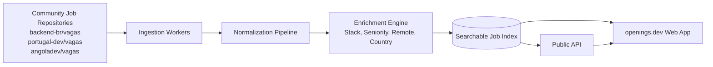

<p align="center">
  <a href="https://openings.dev">
    
  </a>
</p>

<h1 align="center">openings.dev</h1>

<p align="center">
  A global tech jobs aggregator powered by GitHub issues.
</p>

<p align="center">
  
  
  
</p>

---

Thousands of tech jobs are posted every week as GitHub issues across community repositories like `backend-br/vagas`, `portugal-dev/vagas` and `angoladev/vagas`. These openings never reach traditional job boards. **openings.dev** surfaces them all in one place.

## Features

- 🌍 **50+ community repos indexed** across Brazil, Portugal, Angola, LATAM and beyond
- ⚡ **Near real-time updates** as soon as issues are opened on GitHub
- 🧠 **Smart stack detection** for 40+ technologies (React Native, Go, Rust, Kubernetes...)
- 🎯 **Precision filters** by country, remote status, seniority and stack
- 🗂 **Normalized schema** across all source repos
- 🔓 **Public API** for anyone building on top

## How it works



1. Ingestion workers track configured repositories and fetch new or updated issues.
2. Raw issue content is normalized into a shared jobs schema.
3. Metadata is enriched (stack, seniority, remote status, location and tags).
4. Openings are indexed for fast filtering and search.
5. The same index powers both the public API and the web application.

## Quick start

Visit [openings.dev](https://openings.dev) or run locally:

```bash
git clone https://github.com/openings-dev/openings
npm install
npm run dev
```

## Contributing

Know a repo that posts jobs as issues? [Open a PR](https://github.com/openings-dev/openings/pulls) adding it to our sources.

Please read:

- [Contributing Guide](./CONTRIBUTING.md)
- [Code of Conduct](./CODE_OF_CONDUCT.md)
- [Security Policy](./SECURITY.md)
- [Support Guide](./SUPPORT.md)

## License

This project is licensed under the [MIT License](./LICENSE).
